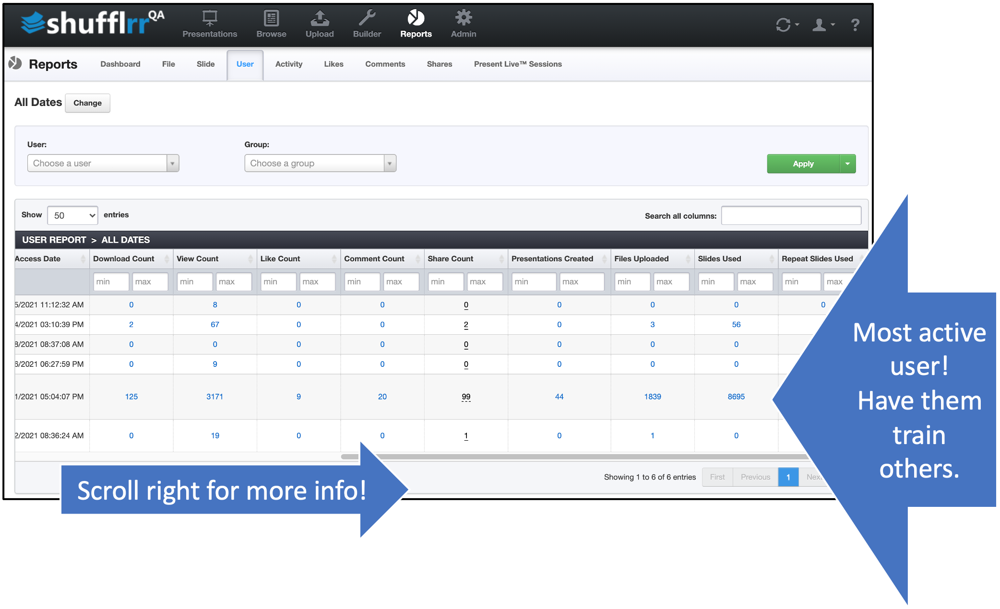

# Reports: User

## Why use the "User" report?

Part of Presentation Management is reporting: tracking what works and what can be improved.

The User tab tells you how users in your system are interacting with your enterprise assets in Shufflrr. Are they uploading slides? Liking and commenting? Sharing with prospects? 

## Steps

Click the "Reports" icon and the "User" tab.

* The dropdowns along the top are filters; set them up and click "Apply" to add them.
* The column header filters can also be used to narrow down what you want to look at. 
* Click "Change" at top left by the dates to select a different date range. 

>**Pro tip!**
>
>See how your top sales and marketing team members use Shufflrr, then recommend those activities to others as best practices!

