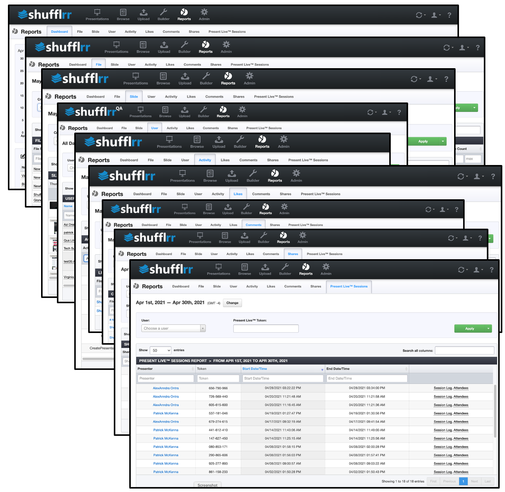

# Reports

Part of Presentation Management is reporting: tracking what works and what can be improved.

Reports allow you to monitor every aspect of your colleagues' and customers' use of Shufflrr. Explore them all to see the wide variety of exciting data that's available! 

