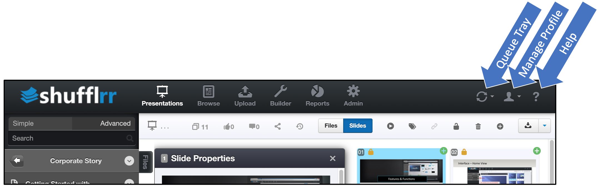

# Top Navigation

## Why use the top right navigation items? 

The navigation items at top right are handy tools that allow users to:
* Track the progress of processing files
* Manage their own user profile
* Get assistance as needed

## Queue Tray

This "tray" slides down to let you know how your files are progressing as they are being processed. More information can be found in the [File Processing](presentations-uploading.md#file-processing) section. 

## Profile

Click the second icon to manage your own settings. 

## Help

The last icon will either take you to the user guide or allow you to contact Shufflrr support. We are very happy to assist you in either capacity.

