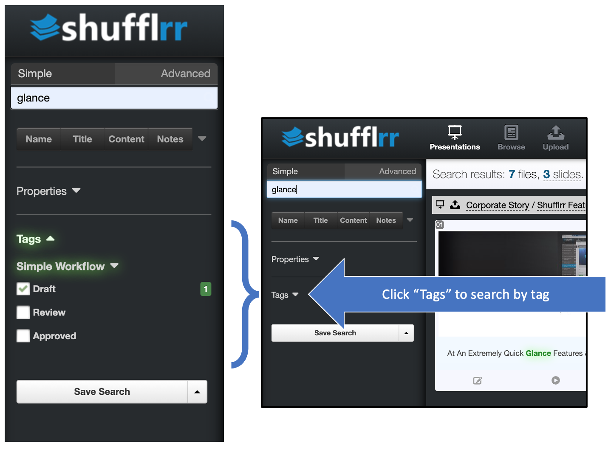
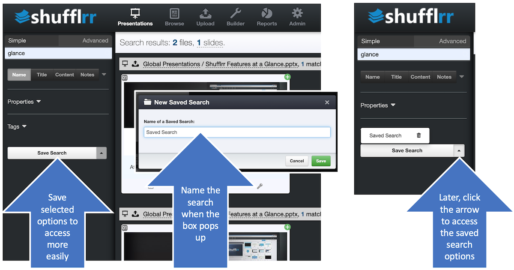

# Advanced Search

## Why use Advanced Search? 

To narrow down where or what you are searching and find content more quickly. 

## Steps

1. Narrow down WHERE you want to search by selecting specific fields: 
	* Document name
	* Slide title
	* Slide content
	* Speaker notes

2. Narrow down WHAT you want to search for by selecting: 
	* Presentations
	* Images
	* Videos
	* Documents
	
3. Use other filters such as dates and creator

4. Tags are also available for search. (For how to use tags, see [admin tags](admin-tags.md)).

5. Lastly, you can save your search for later access. 

