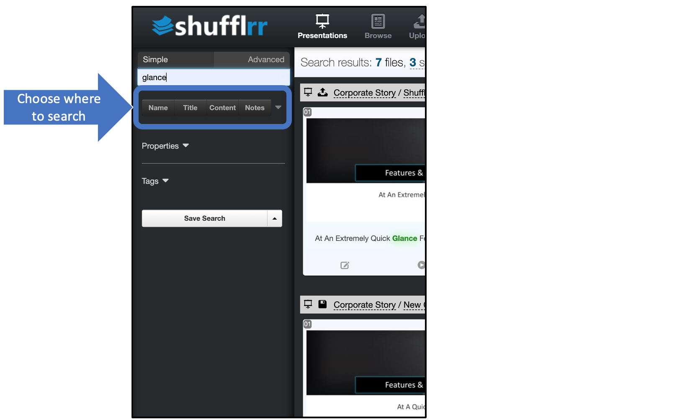
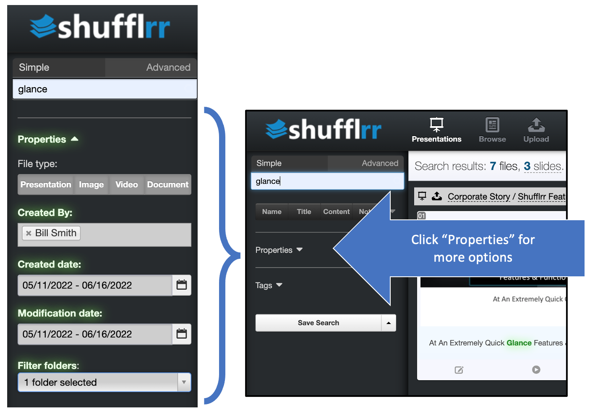

# Search 

## Why search?

Search is key to shuffling slides into new decks and using them on the fly - Presentation Management at its best. Use search to

* Find slides to add to a presentation.
* Find a presentation for editing. 
* Find a slide that isn't in your pre-made deck during a PresentLive session. 

## Steps 
Type a search term in the box at top left. 

You'll get every document with that term in: 
* Document title
* Text 
* Speaker notes
* Tags

Press "return" to see individual slides. This actually flips you into the advanced search. 

Add slides to your slide tray by clicking the green plus. 

> **Pro tip!** 
>
> Search & show any slide on the fly to answer audience questions during PresentLive sessions.

## Advanced Search 

Advanced Search narrows down where or what you are searching through, allowing you to find content more quickly. 

1. Narrow down WHERE you want to search by selecting specific fields: 
	* Document name
	* Slide title
	* Slide content
	* Speaker notes

2. Narrow down WHAT you want to search for by selecting: 
	* Presentations
	* Images
	* Videos
	* Documents
	
3. Use other filters such as dates and creator

4. Tags are also available for search. (For how to use tags, see [admin tags](admin-tags.md)).

5. Lastly, you can save your search for later access. 

