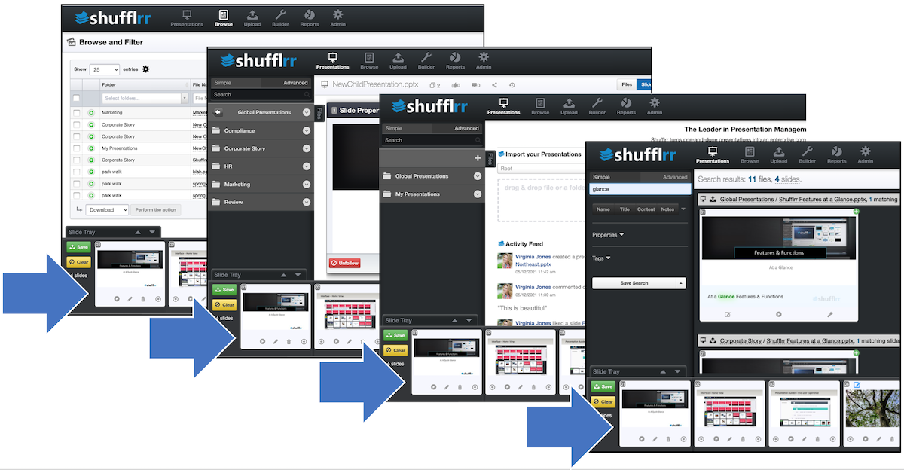

# Slide Tray
## Why use the slide tray?

The Slide Tray is the workbench. It is where the work in progress rests while it's being put together. 

## Steps

The Slide Tray is on all screens all the time for most users. Only the Admin user's Reports and Admin tools pages do not display the Slide Tray.  

From anywhere you see slides, you can add additional slides into the tray. 
* From Search (use the green plus)
* From the Presentations tab displaying another presentation and its slides
* From the Browse tab

Once you have the slides you need, click Save.

>**Pro Tip!**
> 
>Remember to save what you've pulled into your slide tray before working with it. This saves the collected slides into a Child deck that can be updated by the Parent deck. For more information see [Parent-Child Relationships](presentations-slide-inheritance.md).

Once you click save, the presentation will go through processing, then save to your selected folder. For more information see [File Processing](presentations-uploading.md#uploadProcessing).  

