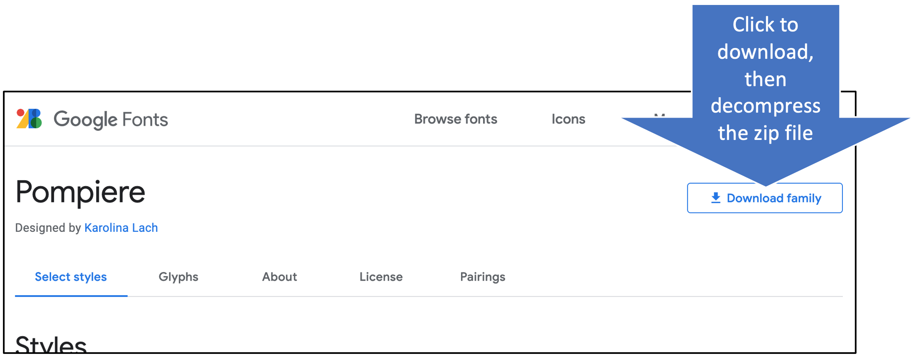
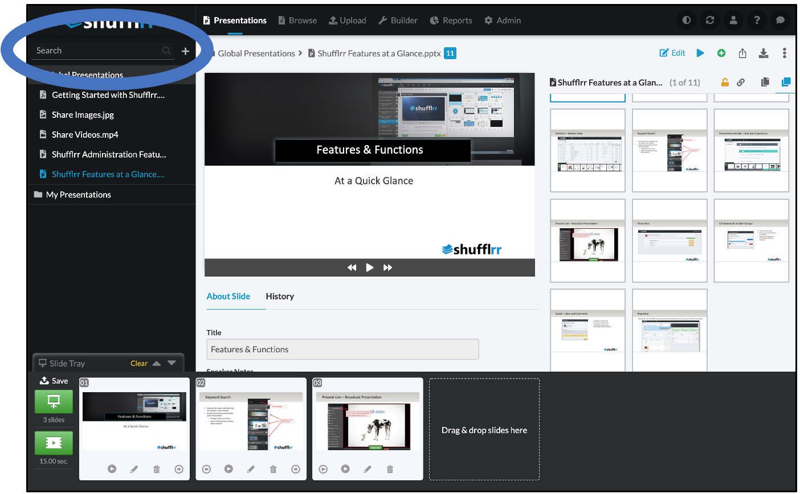
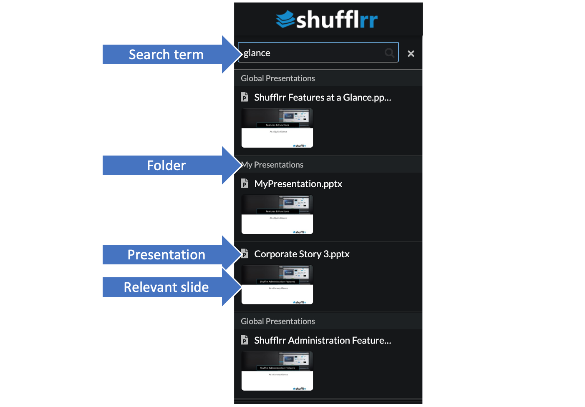
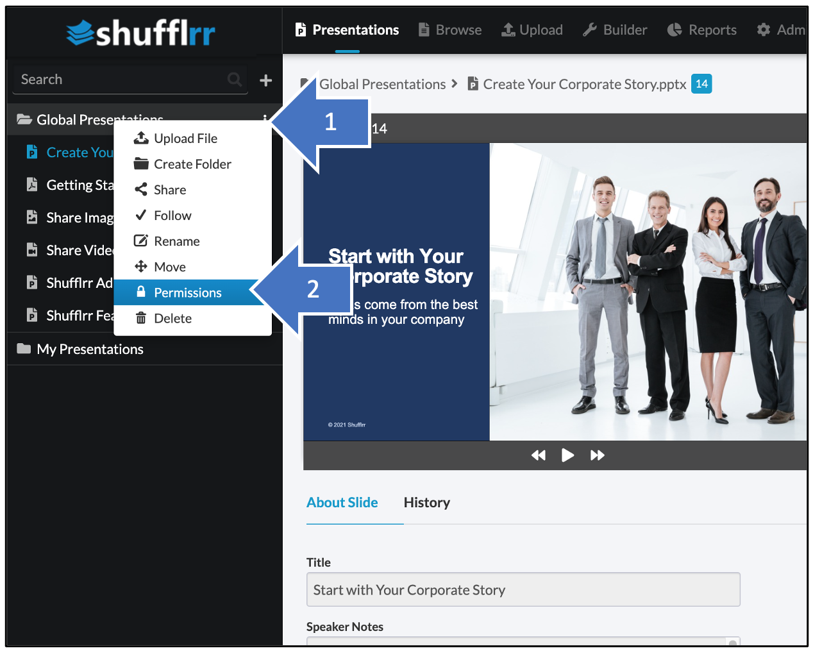
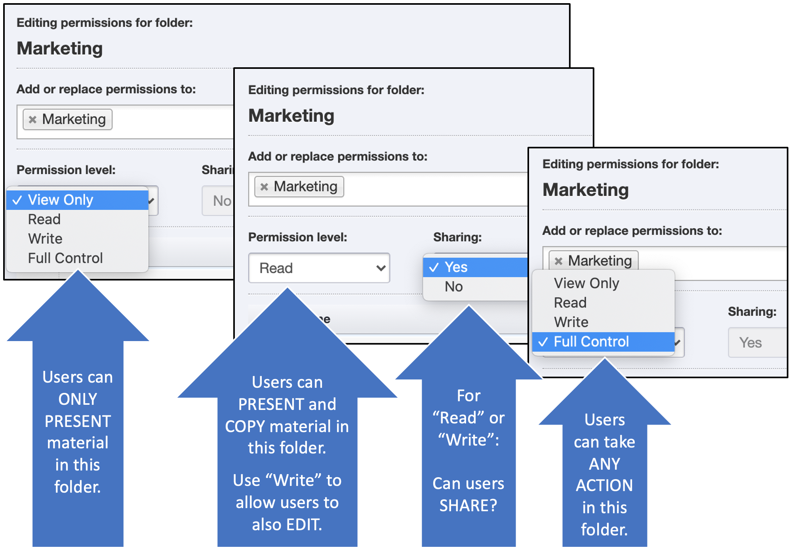

# Getting started

<iframe width="560" height="315" src="https://www.youtube.com/embed/mdMc7PdBhyk?si=kx_IQVaUlZfpRR2c" title="YouTube video player" frameborder="0" allow="accelerometer; autoplay; clipboard-write; encrypted-media; gyroscope; picture-in-picture; web-share" allowfullscreen></iframe>

> **Getting started in Shufflrr is a three-step process:** 
> #### 1. [Upload](#1-Upload)
> #### 2. [Organize](##-2.-Organize)
> #### 3. [Publish](#3-publish)

## 1. Upload

A good way to begin your corporate story is with your most recent 25 presentations.
Why 25 files?  We like to start with 25 files because it is a good, manageable number to start with. Furthermore, the most recent presentations usually have the latest and greatest imagery, branding and messaging. So, it’s a good place to start. 

Collect your best:
* PowerPoints
* Videos
* Images and logos
* PDFs 
* Case studies

>**File types supported:**
> 
>  .pptx, .ppsx, .docx, .pdf .xlsx, .jpg, .png, .bmp, .gif, .mp4, .avi, .wmv, .mov. Other file types (if they are not a security risk, such as .exe) can be stored, such as .psd or .ai, but not scanned for search or used in presentations. Some unsupported file formats, when used in presentations, will break the editing function. Using supported file formats is recommended. 

Click the "Upload" icon in the top navigation to upload files and folders into Shufflrr. 

#### File Processing 

File processing takes a few minutes when a file is added or saved. Here's how to track that: 
* You will see arrows going in a circle at the top right of the screen with a little number showing the number of files being processed.
    

* Click that icon to see the status of your files. 
* Each file goes through two processes: the initial upload and the animation/editing preparation. Those will show on separate lines. 
	* *The first process is to prepare the slides for search. To do this, we create thumbnails and process all text so it is searchable. (After all, if you can’t find it, or see it, then you’re not going to use it!)* 
	* *The second process is to convert your slide to HTML5 so you can see the animations and edit the slides in Shufflrr.*

    
    
* When the first process is finished, you will be able to see the deck in the left navigation and click on it. 
* You will be able to move or delete slides at this point, but not edit slides until the second process has finished. 
* When slides are ready, a blue "Edit" button will appear. Click it to modify the slides.  

> **Pro tip:** 
>
> Accidentally put the folder or file in the wrong place? Click the three dots next to the file or folder name for the option to move it. Select the new parent folder. 

## 2. Organize

Create a folder structure that works best for your corporate story.
 
Your corporate story is like book, made up of chapters, stories and scenes. 
In Shufflrr,
* Every folder is a chapter
* Every presentation is a story
* Every slide is a scene

To create a folder, click the three little dots on the right side of the parent folder name. "Create Folder" is one of the options. The new folder will be inside this one.  

 

Pick your best materials and move them into the corresponding folders for your corporate story.

For example:  
* _Company History.pptx_ would go into the "Corporate Story" folder
* _Pricing.pdf_ goes into the "Product" folder
* _Logo.png_ goes into the "Marketing" folder

### Your company in Shufflrr

To set up your Shufflrr site to reflect your company's branding, click the "Admin" icon and the "Settings" tab. Here, you can set up the site with your company's logo and "favicon" (the little icon that appears in the browser tab for the site).

### Branding

Now that your content is uploaded and sorted into folders, set the corporate brand identity - your fonts and colors. This can be done by an administrator in "Brand Central."

Click the "Admin" icon and the "Brand Central" tab. The first two tabs are essentially empty when first opened. 

#### Colors

If you uncheck the box for all colors, you get 141 pre-set colors. Click "remove preset colors" to remove them so you can limit your colors to only those in your brand identity. 

There are **FOUR** options for entering new colors. Zero in on the color you want and click "Add."

Once you have your brand colors entered, they will appear to the right. 

#### Fonts

To select ***system fonts*** (commonly used fonts such as Arial, Tahoma, Trebuchet, etc.) as your corporate fonts, just click "System Fonts.” All fonts are available by default. If you don’t want a specific font, uncheck the box. Checked fonts are available; unchecked boxes are not.   

You can also ***upload your own fonts***. Shufflrr supports any TrueType fonts (.ttf files). 

For example, if you’re using a Google font, get the TrueType file (.ttf) for that font. You can do this by going to the page for that font and clicking "download font family." 

Double click on the .zip that downloads to extract it. Make sure you know where it is - you will need it in a minute!

Then, in Shufflrr, click "User Fonts" and then "Add Font."

Select the .ttf file from inside the folder that you extracted from the Google download.

Last step - IMPORTANT! Check the box to make this font available. 

 

### Creating

Next, you can select slides from your old content, and shuffle them into new chapters that can be used and/or customized by your team to tell your corporate story.

Your **slide tray** at the bottom of your screen keeps track of what you are building. 

Open presentations you know have slides you need, and drag & drop them into your slide tray. 

> **Pro Tip!**
> 
> You can also use search to find what you want to include. 

### Searching

* Type a search term in the box at top left. 

* You'll get every document with that term in: 
	* Document title
	* Document content 
	* Speaker notes

* Press "return" to see individual slides. 

* If there are duplicates, this makes it easy to pick the best and most updated version. 
* Add slides to your slide tray by clicking the green plus. 

You can also use [advanced search](shufflrr-advanced-search.md) for more precise search options. 

Perform more searches to get more slides. 

## 3. Publish

Once your content is organized, it's time to publish to your users and/or groups, so that everyone can use the library of curated slides to build custom presentations for their own purposes.

Publishing has three steps: adding users to the system, adding users to groups, and giving groups permissions to folders. 

### Users

To add a user, click the "Admin" icon and "Users" tab. Click the green "Add User" button. 

### Groups

When your Shufflrr site is first set up, there are five existing groups: 
* All Users 
* Billing Administrators
* Portal Administrators
* Reporting Users
* User Administrators

Each one has specific roles (capabilities) on your Shufflrr site. [Learn more about roles](admin-groups.md#more-about-roles).

All of these can be modified or deleted, except that the "All Users" group cannot be deleted. This is the group that has all site users as members, by default. 

>**Pro Tip!**
> 
> If a user is a member of multiple groups, they have **all** the roles from **all** the groups. So, removing roles from "All Users" does not affect users' roles from the other groups they belong to.  

#### Creating new groups

Go to the groups tab & click "Add Group." 

Once you have saved your group, you are automatically taken to the group settings. Check off the roles you would like for this group overall (not in reference to a folder yet). 

Click the "Add Users" tab and add users to your new group.

### Permissions
You can use permissions to organize who can see what content, and who can use it, and use it in which ways. 

To set up permissions, click the three dots at the right side of the folder name. Select "Permissions."

 

In the first box, type the name of the group who should have permissions to this folder. 

Select View Only, Read, Write, or Full Control.
* _View Only_ means users can only view & present from this folder, but cannot copy, download, or change slides in this folder. 
* _Read_ means users can see slides from this folder, and pull slides from here to make new presentations, but cannot change slides in this folder. 
* _Write_  means users can edit the slides and presentations in this folder. 
* _Full Control_ means users can take any action on material in the folder, as well as updating permissions on the folder itself. 

>**Pro tip!** 
>
> For Read or Write, select whether this group can share presentations or not (Full Control always allows sharing; View Only never allows sharing). Sharing a presentation gives the user the ability to send it to anyone internal or external in a read-only, slide-show-viewer format. 
 

